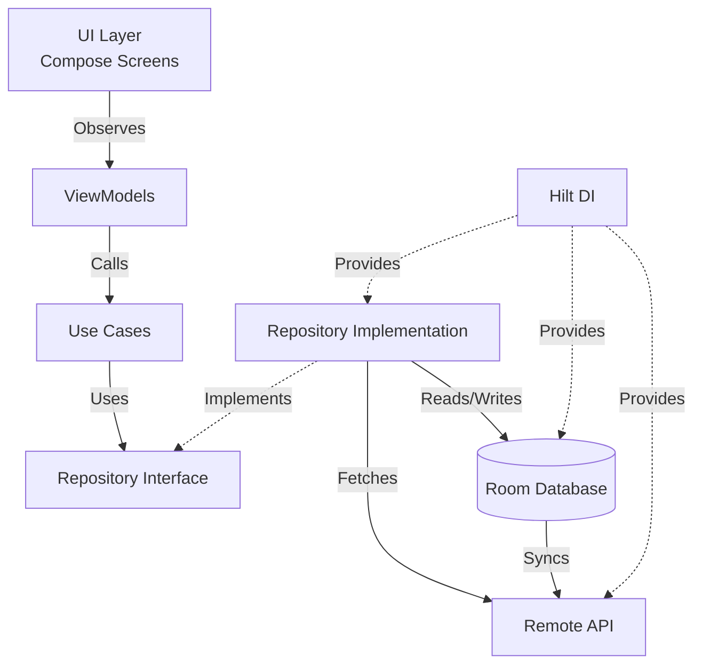

# HR Management App Structure Setup

## Architecture Overview

The app will follow **MVVM pattern with Clean Architecture** principles, organized into three main layers:

```
app/src/main/java/com/example/ihrm/
├── data/           # Data layer (Room DB, API, Repositories)
├── domain/         # Domain layer (Use cases, Models, Repository interfaces)
├── ui/             # UI layer (Screens, ViewModels, Navigation)
├── di/             # Dependency Injection modules
└── util/           # Utilities and extensions
```

## Implementation Plan

### 1. Dependency Configuration

- Add Hilt for dependency injection
- Add Room database for local storage
- Add Retrofit + OkHttp for API calls
- Add Navigation Compose for screen navigation (with drawer support)
- Add Coroutines and Flow dependencies
- Add Gson/Moshi for JSON parsing
- **Note:** Target SDK is already set to 35 in build.gradle.kts

**Files to modify:**

- `gradle/libs.versions.toml` - Add version catalogs for new dependencies
- `app/build.gradle.kts` - Add plugins and dependencies
- `build.gradle.kts` - Add Hilt plugin to classpath
- `app/src/main/java/com/example/ihrm/MainActivity.kt` - Add `@AndroidEntryPoint` annotation

### 2. Package Structure Creation

#### Data Layer (`data/`)

- `data/local/` - Room database, DAOs, entities
- `data/remote/` - API service, DTOs, network configuration
- `data/repository/` - Repository implementations
- `data/di/` - Data layer DI modules

#### Domain Layer (`domain/`)

- `domain/model/` - Domain models (Employee, Department, etc.)
- `domain/repository/` - Repository interfaces
- `domain/usecase/` - Business logic use cases

#### UI Layer (`ui/`)

- `ui/employee/` - Employee-related screens and ViewModels
  - `list/` - Employee list screen
  - `detail/` - Employee detail screen
  - `addedit/` - Add/Edit employee screen
- `ui/navigation/` - Navigation setup and routes
- `ui/components/` - Reusable UI components
  - `DrawerMenu.kt` - Drawer navigation menu component
- `ui/theme/` - Already exists, keep as is

#### DI Layer (`di/`)

- `AppModule.kt` - Application-level dependencies
- `DatabaseModule.kt` - Room database setup
- `NetworkModule.kt` - Retrofit/OkHttp setup
- `RepositoryModule.kt` - Repository bindings

#### Utils (`util/`)

- `util/Constants.kt` - App constants
- `util/extensions/` - Extension functions

### 3. Core Components to Create

#### Database Setup

- `data/local/EmployeeDatabase.kt` - Room database class
- `data/local/entity/EmployeeEntity.kt` - Employee Room entity
- `data/local/dao/EmployeeDao.kt` - Employee DAO interface

#### API Setup

- `data/remote/api/EmployeeApiService.kt` - Retrofit API interface
- `data/remote/dto/EmployeeDto.kt` - API response DTOs
- `data/remote/mapper/EmployeeMapper.kt` - DTO to Entity/Domain mapper

#### Domain Models

- `domain/model/Employee.kt` - Employee domain model
- `domain/repository/EmployeeRepository.kt` - Repository interface

#### Repository Implementation

- `data/repository/EmployeeRepositoryImpl.kt` - Implements domain repository

#### Use Cases

- `domain/usecase/GetEmployeesUseCase.kt`
- `domain/usecase/GetEmployeeByIdUseCase.kt`
- `domain/usecase/AddEmployeeUseCase.kt`
- `domain/usecase/UpdateEmployeeUseCase.kt`
- `domain/usecase/DeleteEmployeeUseCase.kt`
- `domain/usecase/SyncEmployeesUseCase.kt` - For API sync

#### ViewModels

- `ui/employee/list/EmployeeListViewModel.kt`
- `ui/employee/detail/EmployeeDetailViewModel.kt`
- `ui/employee/addedit/AddEditEmployeeViewModel.kt`

#### UI Screens (Placeholder Composables)

- `ui/employee/list/EmployeeListScreen.kt`
- `ui/employee/detail/EmployeeDetailScreen.kt`
- `ui/employee/addedit/AddEditEmployeeScreen.kt`

#### Navigation

- `ui/navigation/NavGraph.kt` - Navigation graph setup with drawer integration
- `ui/navigation/Screen.kt` - Screen route definitions
- `ui/components/DrawerMenu.kt` - Drawer menu component with navigation items
- **Note:** Using Material3 Drawer (ModalDrawerSheet) instead of bottom navigation

#### Application Class

- `IHRMApplication.kt` - Application class with `@HiltAndroidApp`

### 4. Configuration Files

- Update `AndroidManifest.xml` to register Application class
- Add network security config if needed for API calls

## Architecture Flow



## File Structure Summary

**New directories to create:**

- `data/local/entity/`
- `data/local/dao/`
- `data/remote/api/`
- `data/remote/dto/`
- `data/remote/mapper/`
- `data/repository/`
- `data/di/`
- `domain/model/`
- `domain/repository/`
- `domain/usecase/`
- `ui/employee/list/`
- `ui/employee/detail/`
- `ui/employee/addedit/`
- `ui/navigation/`
- `ui/components/`
- `di/`
- `util/extensions/`

**Key files to create:** ~25-30 new Kotlin files

## Additional Notes

- **Navigation:** The app will use a **drawer menu** (Material3 ModalDrawerSheet) instead of bottom navigation for primary navigation
- **Target SDK:** Already configured to SDK 35 in build.gradle.kts
- **MainActivity:** Will integrate drawer navigation with Scaffold and ModalDrawerSheet

This structure provides a solid foundation that can be extended with additional features (departments, search/filter, etc.) as needed.